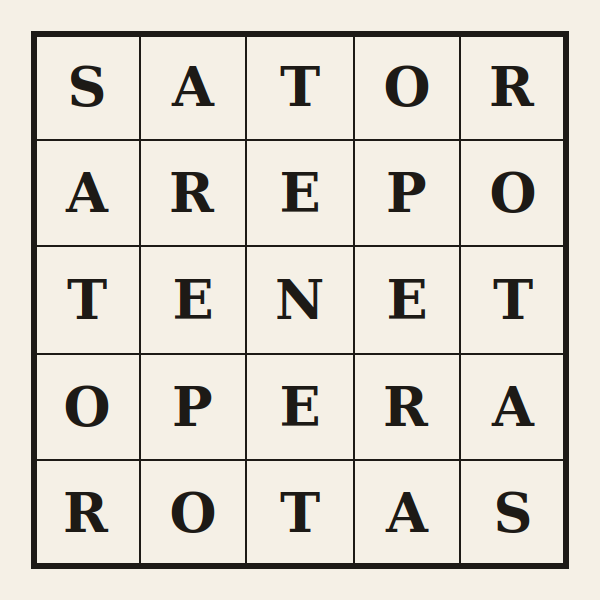

# Arepo - MoE AI Text Workbench

<p align="center">
  
</p>

Arepo scores text with a 4D Benford/mantissa engine and a mixture of local Gaussian experts. It reports confidence levels and evidence classes instead of forcing every text into a binary Human/AI verdict. The public UI treats windows as evidence, then aggregates that evidence at document level.

<p align="center">
  <a href="https://akolpakov-satorarepo.hf.space/"><strong>Launch the public GUI on Hugging Face</strong></a>
</p>

## Authors

<table>
  <tr>
    <td width="190" align="center">
      
    </td>
    <td>
      <p>Arepo is authored by:</p>
      <ul>
        <li>Alexander Kolpakov (<a href="https://github.com/sashakolpakov">sashakolpakov</a>)</li>
        <li>Aidan Rocke (<a href="https://github.com/nautacoeli">nautacoeli</a>)</li>
        <li>Humam al'Jammas (<a href="https://github.com/humamj1">humamj1</a>)</li>
      </ul>
    </td>
  </tr>
</table>

## Method

1. Extract four KS statistics from transformer embedding mantissas.
2. Score the 4D vector with a mixture of oriented Gaussian experts.
3. Use 4D context-plane alignment to compute geometric confidence.
4. Classify each window as `hard_ai`, `hard_human`, `soft_ai`, `soft_human`, or `ambiguous`.
5. Aggregate document evidence using window distributions, hard-evidence coverage, soft-evidence balance, and scale consistency.

The old bagged path is not part of the production server.

## Confidence-First Output

Arepo is designed to avoid the common AI-detector failure where historic,
formal, or public-domain human prose gets declared AI-generated with fake
certainty. The Declaration of Independence, Moby-Dick, Jane Eyre, template
emails, encyclopedia prose, and generated boilerplate can all contain windows
whose observable statistics overlap.

The engine therefore reports:

- Human and AI scores
- geometric confidence
- hard, soft, or ambiguous local evidence
- hard/ambiguous evidence coverage across windows
- a document evidence label separate from the whole-document posterior lean

A narrow AI lean with weak geometric support is not treated as a hard AI
claim. If the signal is weak, Arepo says so.

## Install

```bash
pip install -e ".[test]"
```

Requirements: Python 3.8+, PyTorch, Transformers, SciPy, NumPy, scikit-learn, Flask.

## Download Models And Data

```bash
arepo-download --models
arepo-download --all
```

Bundled sample/control data lives under `src/arepo/data/`.

## Serve The UI

```bash
arepo-web
```

Optional model override:

```bash
arepo-web --model src/arepo/models/long_guardrail_4d_baseline_w120.npz
```

The default server model is:

```text
src/arepo/models/long_guardrail_4d_baseline_w120.npz
```

## CLI Tools

```bash
arepo-mixture      # train/evaluate MoE expert models
arepo-evaluate     # score datasets with the MoE engine
arepo-guardrails   # evaluate guardrail rows with the MoE engine
arepo-report       # generate document/window evidence reports
arepo-renorm       # window/renormalization experiments
arepo-thresholds   # threshold and calibration experiments
```

Generated `reports/` and `visualizations/` are experiment artifacts and should not be committed unless they are explicitly used by docs or reproducibility evidence.

## Tests

```bash
pytest -m unit -v
pytest -m slow -v
pytest -m reproducibility -v
```

The unit suite avoids network/model downloads. Integration tests load transformer models.

## Documentation

The mathematical and operational docs are Sphinx-based:

```bash
pip install -e ".[docs]"
python3 -m sphinx -W -b html docs docs/_build/html
```

The docs workflow builds on pull requests and deploys GitHub Pages from `main`.

## CI Server Smoke Test

GitHub Actions starts the Flask app briefly, checks `/health` and
`/demo-corpus`, then shuts it down. This validates the server boundary in
CI; it is not a public hosting setup.

## Project Structure

```text
src/arepo/
    core.py                    # transformer feature extraction
    stats.py                   # mantissa stats and Gaussian primitives
    mixture_experts.py         # MoE training/scoring
    evidence.py                # public evidence classes and aggregation
    web.py                     # Flask UI/API backed by MoE
    evaluate_moe.py            # MoE dataset scoring
    guardrail_evaluation.py    # guardrail row construction/evaluation
    training_data.py           # dataset loaders for expert training
    templates/index.html       # 90s-style workbench UI
```

## License

See LICENSE.
